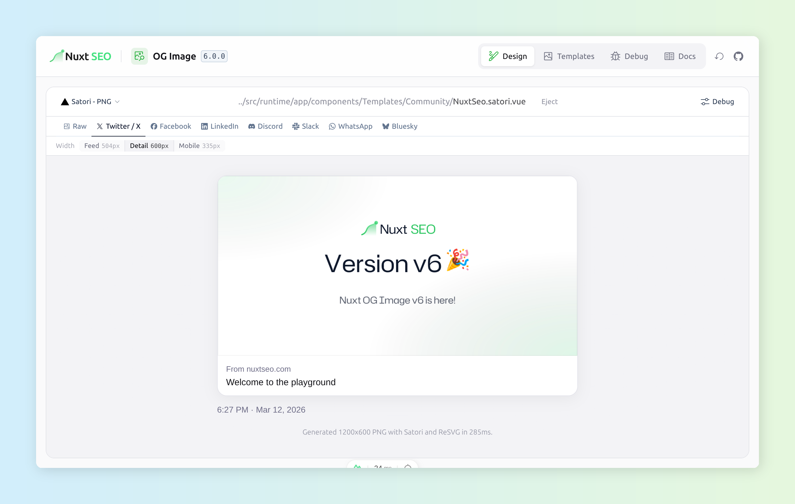

<h1>nuxt-og-image</h1>

[![npm version][npm-version-src]][npm-version-href]
[![npm downloads][npm-downloads-src]][npm-downloads-href]
[![License][license-src]][license-href]
[![Nuxt][nuxt-src]][nuxt-href]

Nuxt OG Image allows you to easily generate OG Images using either Vue components or screenshots of your pages.

OG Images are known to improve click-through rates on social media.

New to Open Graph? Check out the [Mastering Open Graph Tags](https://nuxtseo.com/learn/mastering-meta/open-graph) guide to learn more about why you might
need this module.

<p align="center">
<table>
<tbody>
<td align="center">
<sub>Made possible by my <a href="https://github.com/sponsors/harlan-zw">Sponsor Program 💖</a><br> Follow me <a href="https://twitter.com/harlan_zw">@harlan_zw</a> 🐦 • Join <a href="https://discord.gg/275MBUBvgP">Discord</a> for help</sub><br>
</td>
</tbody>
</table>
</p>

## Features

- ✨ Create an `og:image` using the built-in templates or make your own with Vue components
- 🎨 Design and test your `og:image` in the Nuxt DevTools OG Image Playground with full HMR
- ▲ Render using [Satori](https://github.com/vercel/satori) or [Takumi](https://github.com/kane50613/takumi): Tailwind / [UnoCSS](https://unocss.dev) with your theme, Google fonts, 6 emoji families and more.
- 🤖 Or prerender using the Browser: Supporting painless, complex templates
- 📸 Feeling lazy? Generate screenshots for every page: hide elements, wait for animations, and more
- ⚙️ Works on the edge: Vercel Edge, Netlify Edge and Cloudflare Workers

## Installation

Install `nuxt-og-image` dependency to your project:

```bash
npx nuxi@latest module add og-image
```

> [!TIP]
> Generate an Agent Skill for this package using [skilld](https://github.com/harlan-zw/skilld):
> ```bash
> npx skilld add nuxt-og-image
> ```

## Documentation

[📖 Read the full documentation](https://nuxtseo.com/og-image/getting-started/installation) for more information.

## Demos

- [👾 &nbsp;Playground](https://stackblitz.com/edit/nuxt-starter-pxs3wk?file=nuxt.config.ts)

## Sponsors

<p align="center">
  <a href="https://raw.githubusercontent.com/harlan-zw/static/main/sponsors.svg">
    
  </a>
</p>

## License

Licensed under the [MIT license](https://github.com/nuxt-modules/og-image/blob/main/LICENSE.md).

<!-- Badges -->
[npm-version-src]: https://img.shields.io/npm/v/nuxt-og-image/latest.svg?style=flat&colorA=18181B&colorB=28CF8D
[npm-version-href]: https://npmjs.com/package/nuxt-og-image

[npm-downloads-src]: https://img.shields.io/npm/dm/nuxt-og-image.svg?style=flat&colorA=18181B&colorB=28CF8D
[npm-downloads-href]: https://npmjs.com/package/nuxt-og-image

[license-src]: https://img.shields.io/github/license/nuxt-modules/og-image.svg?style=flat&colorA=18181B&colorB=28CF8D
[license-href]: https://github.com/nuxt-modules/og-image/blob/main/LICENSE.md

[nuxt-src]: https://img.shields.io/badge/Nuxt-18181B?logo=nuxt
[nuxt-href]: https://nuxt.com
